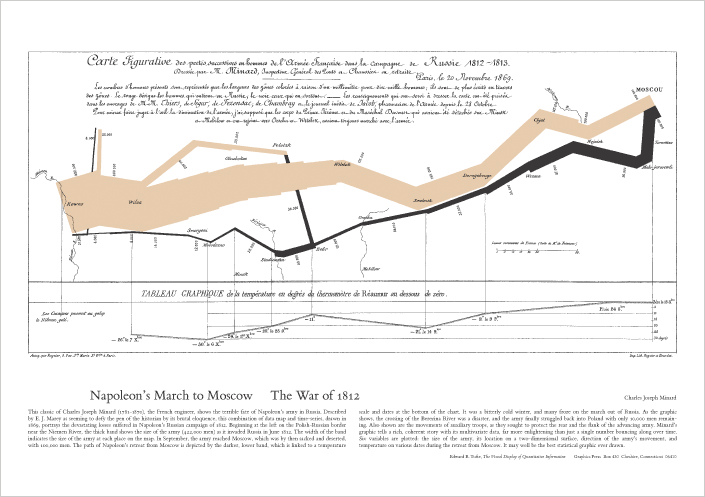
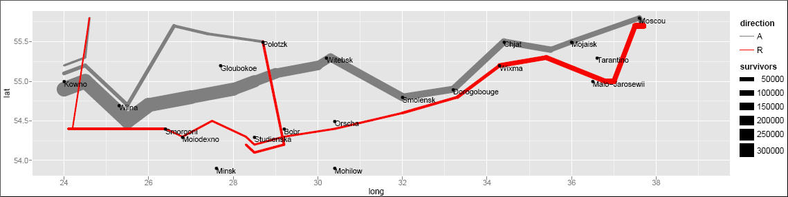

Introduction
=============

Data visualization is the graphical display of abstract information to help us
make sense of phenomena and to communicate these findings. It is a powerful
tool to help us uncover and share the stories of our data. Visualizations help
us retain and analyze all the information in our data, uncover and share our
insights, and describe our research in a useful way. *If a picture is worth a
thousand words, then a good data visualization is worth millions.* 

But, how many of us have ever taken a course explicitly on data visualization?
It’s typically not taught in standard data analysis courses, yet it is a
mainstay for nearly every sector in today’s data-driven world. Today we’ll dive
into the what, how, and why of data visualization and describe some best
practices that you can immediately implement into your research workflows.
Along the way we’ll also focus on building up our collective data literacy
skills, and employ critical approaches to produce science that is more robust,
transparent, and equitable. 

A Brief History of Data Visualization
-------------------------------------

 
*[Image by Jose Barcelona - Own work, CC BY-SA
4.0](https://commons.wikimedia.org/w/index.php?curid=96668758)*

 

Data visualization is not a modern invention. Quantitative information display
has been traced back to prehistory with the locations of stars mapped on the
[Lasaux cave drawings](https://en.wikipedia.org/wiki/Lascaux). [Clay
tokens](https://en.wikipedia.org/wiki/History_of_ancient_numeral_systems#/media/File:Accountancy_clay_envelope_Louvre_Sb1932.jpg),
[quipu](https://en.wikipedia.org/wiki/Quipu#/media/File:Inca_Quipu.jpg), and
[stick
charts](https://en.wikipedia.org/wiki/Marshall_Islands_stick_chart#/media/File:Micronesian_navigational_chart.jpg)
dating back as far as 5500 BC also illustrate our long history of creating
shared representations of data. The oldest known data visualization dates to
1160 BC with the [Turin Papyrus
Map](https://en.wikipedia.org/wiki/Turin_Papyrus_Map#/media/File:TurinPapyrus1.jpg),
which accurately illustrates the distribution of geological resources in a
region in Egypt. These earliest forms of data visualization served purposes of
navigating culture and living within society - from accounting to agriculture,
transportation, religion, and medicine. They were used to help us explore and
understand natural phenomena and the workings of the universe. 

The French philosopher Rene Descartes is attributed as developing the precursor
to today’s modern plot in the 17th century - a two-dimensional coordinate
system for displaying values. Later in the 18th century William Playfair began
creating left to right oriented plots, allowing the viewer to explore how
values change over time. He’s also attributed to inventing the bar graph and,
unfortunately, the pie chart (we'll get to why that's unfortunate, later). Into
the 19th and 20th centuries we see an explosion of chart types

Unsurprisingly, the invention of tools like paper and computers shaped our
relationship with knowledge and information, playing a strong role in how we
collect, analyze, store and visualize data. As we gather more and more complex
data, we seek more ways to visualize its meaning and in the 19th and 20th
centuries we see an explosion of chart types and techniques for communicating
with statistical graphics. 

For a more complete history of data visualization, check out ["Milestones in
the history of thematic cartography, statistical graphics, and data
visualization"](https://link.springer.com/chapter/10.1007/978-3-540-33037-0_2),
by M. Friendly. 

In particular, check out the following famous data visualizations.

Famous Data Viz
------------------------

**Florence Nightingale**, the "mother of nursing," produced in 1857 a rose
diagram depicting seasonal sources of British soldier's fatalities in the
Crimean War. Out of the 18,000 soldiers who had died, 16,000 had died of
disease in a hospital (blue shading) rather than from their wounds (black
shading). This image is credited with helping to persuade the British
government to improve conditions in military hospitals.

**John Snow**, a London physician, traced the source of an 1854 cholera
outbreak in Soho. By examining the locations of reported cholera deaths, Snow
demonstrated that the disease was connected to a contaminated well on Broad
Street, contributing to growing understanding that cholera was a waterborne
disease and not caused by foul 'miasmas' in the air. He later used a map in his
publication to show the concentration of the cholera cases around the
contaminated pump. On this map, the height of the dark bars correspond to the
number of deaths at a given location. While Snow didn't invent the mapping
technique of layering thematic data on top of topographic maps, nor actually
compose the map himself (it was created by cartographer Charles Cheffins), this
map was so effective that history often calls Snow the "father of
epidemiology." Learn more about the history of the map in this recent [post by
Kenneth
Field](https://www.esri.com/arcgis-blog/products/arcgis-pro/mapping/something-in-the-water-the-mythology-of-snows-map-of-cholera/).

Lastly, no discussion of the history of data visualization is complete without
a nod to Charles Minard's acclaimed depiction of Napoleon Bonaparte's ill-fated
invasion of Russia. Edward Tufte declared in his popular 1983 book *The Visual
Display of Quantitative Information* that **Napoleon's March** "may well be the
best statistical graphic ever produced." The thick band denotes the size of the
army at each position, beginning at the Polish-Russian border. The dark lower
band is tied to temperature and time scales, and shows the path of Napoleon's
retreat from Moscow and shinking army size during the bitterly cold winter.

This image has also been recreated with modern plotting software, including the
ggplot2 package in R.

*(from ggplot2: Grammar of Graphics in R by Hadley Wickam)*

