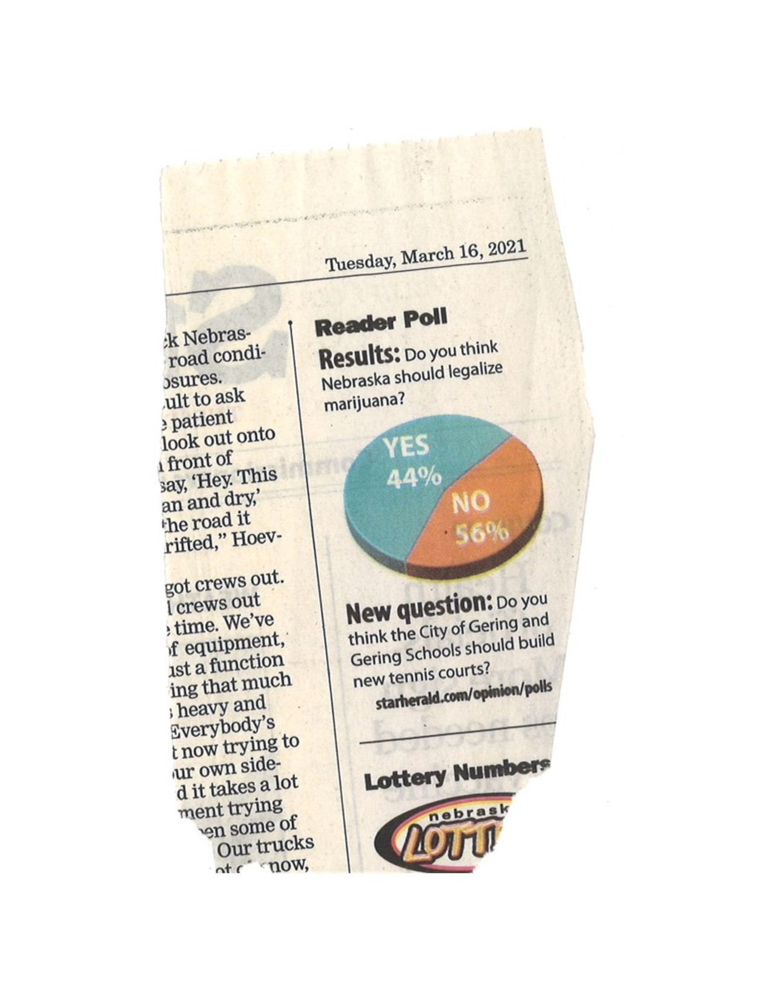

What is Data Visualization?
=============

At their core, data visualizations are products that:

* Represent data.
* Have a specific purpose.
* Tell a data-driven story.

There are two main types of data visualizations. Information visualizations (aka infographics or infoviz) tend to be visually striking, dramatizing a problem with unique and visually appealing imagry that draws the casual viewer in. In contrast, statistical graphics aim to make comparisons, to reveal patterns and discrepancies. We use statistical graphs to communicate our research results, often for viewers who are already immersed or interested in the problem. While many topics within this reader will apply to infoviz as well, our emphasis is on creating judicious and accurate statistical graphics. *(For more info comparing infoviz and statistical graphs, see [Gelman and Unwin 2013](https://www.jstor.org/stable/43304809?seq=1).)*

Why viz?
----------------------------

There are lots of ways to represent our data. In fact, tables are often the most common way to report data, and they are great at conveying exact values. But, interpretation of data displayed in a table is largely up to the viewer. It’s hard to perceive the overall summary of the data from a table, unless it’s really simple and, in that case, you often don’t even need a table and can just report those statistics as text. 

Data visualization, on the other hand, take advantage of our ability to process information by shifting the balance between our natural perceptive and cognitive abilities to convey a specific message. Most of the information that’s sent to our brains is visual. In fact, it’s been found that the human brain processes visual imagery 60,000 times faster than text! Data visualizations allow us to move from a predominantly thinking to a seeing perspective. The cerebral cortex, which primarily handles our cognition, is slow and less efficient than the visual cortex, which processes images. Thus, visual diagrams are often easier for us to process than pages of words describing our research. Absorbing information quickly allows us to uncover novel inferences, and make more productive and informed decisions. Not surprisingly, well composed data visualizations are the most effective type of scientific communication.

*For guidance on how to convert a table into a plot, see [this paper by Andrew Gelman](http://www.stat.columbia.edu/~gelman/research/published/dodhia.pdf).*

Ultimately, the utility of a data visualization depends on how well it's composed.

Good data visualizations
-------------------------

* Provide rapid access to data. 
* Faithfully represent the data and tell a story.
* Are expressive.
* Are effective.

Helpful data visualizations are intuitively, clearly, accurately, and efficiently explain complex ideas. The patterns and relationships presented must be valid, and the visual relevant to the data it presents. A data visualization cannot exist without a narrative, and good data visualizations always include context. Good plots grab our attention and create a positive visual impact. This aids our ability to make connections and recall the features of the data. They can be aesthetically pleasing, but that's not the end goal. Good plots are accessible (not everyone perceives the visual world the same way). They leverage aspects of human perception to allow for intuitive inference of relationships between abstract concepts (our data).

Want to feel inspired? Check out [Information is Beautiful](https://informationisbeautiful.net/) and [Flowing Data](https://flowingdata.com/).

[source](https://informationisbeautiful.net/visualizations/best-in-show-whats-the-top-data-dog/)

Bad data visualizations
------------------

* Have too much, or too little, information.
* Are inconsistent.
* Ignore limits of human perception.
* Misrepresent the data.
* Use inappropriate (or garbage) data.

Have you ever seen a pie chart where the labeled slices add up to something other than 100%? That's a poorly executed data visualization. Goal: don't end up on [WTF Viz](https://viz.wtf/).

*[source](https://viz.wtf/post/646651837987061760/the-star-herald-starherald-has-a-daily-poll)*
