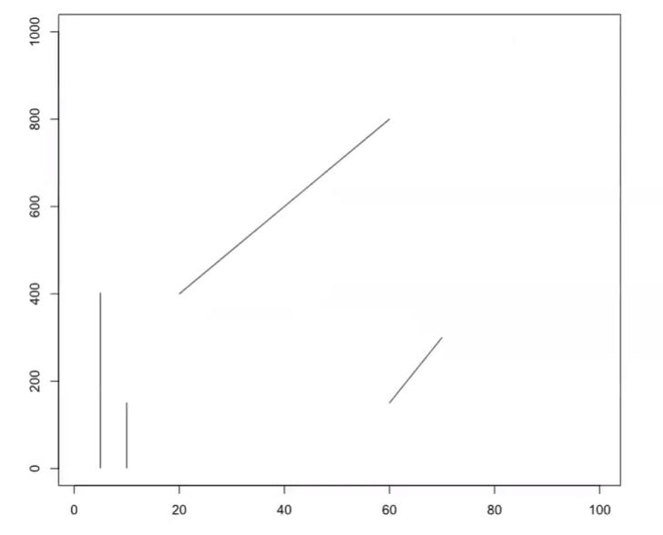

Principles of Visual Perception
=============

Levergaing principles of visual perception - the ability to see and interpret  surrounding visual information - will help us identify appropriate plot types and design better, more informative graphics. Humans are wired to look for structure, patterns, and logic. Our brains are amazing - they take ambiguous visual information and transform it into something organized, symmetrical, or familiar so we can understand it. But, we don't process all visual information equally.

Visual Magic Tricks
----------------------------

Take a look at the following questions and images.

Which line is bigger?

Which inner circle is bigger?

Do these lines connect?

Is the center bar in this image by [Dodek](https://upload.wikimedia.org/wikipedia/commons/1/1e/Gradient-optical-illusion.svg) a gradient?

What shape(s) do you see in [this image](https://commons.wikimedia.org/w/index.php?curid=13901986)?

*Answers: a) Measure them - they're the same length! b) The circles are the same size. c) The lines do NOT connect. Hold up a ruler or straight edge and prove it for yourself. d) Nope! It's a solid color.* e) Did you see a vase or two faces?

Thes visual "magic tricks" work because they capitalize on innate weaknesses in our visual perception.

Steven’s Psychophysical Power Law
-------------------------------

Research studies by Stanley Smith Stevens and others have shown that we exhibit innate biases in how we perceive magnitude changes in the intensity of various types of stimuli. For example, we perceive an electric shock to increasing in intensity greater than it actually does. We're also poor at accurately perceiving changes in brightness and estimate it to increasing less than it actually does. However, we have near perfect perception of length proporitional to its actual increase. This is especially true if lengths are aligned and on the same scale. Knowing this can help us design more intuitively useful plots.

[Figure 5.7 from Visualization Analysis and Design by Tamarna Munzner](https://www.oreilly.com/library/view/visualization-analysis-and/9781466508910/)

Perception and Encodings
------------------------------

Based on psychophysics, we can rank encodings to help us identify which ones will more accurately allow us to judge differences in relative magnitudes, which is important when working with ordinal, interval or ratio data.

*[Jock Mackinlay, 1986, Computer Science ACM Trans. Graph.](https://doi.org/10.1145/22949.22950)*

Fron most to least accurate by magnitude perception:

* **Position along a common scale.** Spatial position is the easiest feature for us to recognize and evaluate, and unsurprisingly is used in the most common plot types: bar charts, scatterplots.
* **Positions along identical but nonaligned scales.** Small multiples, grid, lattice, panel, and Rellis charts.
* **Length.** We can easily recognize proportions and evaluate lengths, especially when they are aligned, such as in bar charts.
* **Direction.** We recognize directionality fairly easily. Trend charts utilize this to demonstrate changes over time. 
* **Angle, slope.** It's harder to evaluate angles than length or position. Pie charts can be as efficient as stacked bar charts, unless there are more than 3 parts to the whole. But ask yourself - if there are fewer than 3 or fewer parts, do you really need a visualization?
* **Area.** Determining the relative magnitude of areas is much harder compared to lengths, and should be used (like in bubble charts) for indicating the relative importance, and not absolute magnitude changes. 
* **Volume.** 3D objects as represented in 2-D space are hard to evaluate. Avoid them. I'm looking at you exploding 3D pie chart.
* **Curvature** Perceiving changes in the degree of a curve magnifies the difficulties in detecting direction, angle, and non-aligned lengths. 
* **Density, color saturation and shading.** Color is the least accurate way to convey patterns. Saturation is the intensity of a single hue, and increasing color intensity is intuitively perceived as correlating to an increasing value. But, individual hues are hard to compare to one another. Heatmaps along the same color gradient can be a good way to convey an overall picture of change in values over a range. We'll talk more about color later on.
* **Color hue.** For data visualizations, color hue is the most challenging encoding to detect changes in magnitude.

Evaluating Graphics
----------------------------

“No matter how clever the choice of the information, and no matter how technologically impressive the encoding, a visualization fails if the decoding fails” (Cleveland 1983). But how do we detect if our encodings have failed? Munzner uses the principles of expressiveness and effectiveness to help us evaluate our data visualizations.

The **expressiveness** of a visual encoding should "express all of, and only, the attributes of the data." It is violated when we use encodings that do not match our data type or our visualization goals. When it fails, a chart is not only suboptimal and confusing, it can be incorrect and misleading. Charts can fail the expressivness test if their encodings imply ordering when there actually is none, or they mis-order a variable. 

The **effectiveness** of a visual encoding addresses how accurately can the interpreter of the chart decode the encodings within it and derive accurate knowledge. According to Munzner, "the importance of the attribute should match the salience of the channel," meaning we should use channels at the top of the list to encode the variables that are the most important to communicating our data story.

When looking at a plot, can you accurately detect differences is the sizes of the bubbles? Can you discriminate between all of the colors, compare the shades? Can you separate the dimensions of the data? 

Taking these principles together, when we want to compare magnitudes of **ordinal data** (numeric, continuous, or ordered qualitative data - like heigh, weight, number of children in a family, or a rating), we should use encodings at the top of Mackinlay's list above. Conversely, for **nominal data** (categorical or un-ordered qualitative data - like gender), use these identity channels: 

* **Shape.** Glyphs are effective at grouping categorical attributes together. But, be mindful that the more shapes you use, the harder it will be for a viewer to remember what corresponds to which specific data attribute.
* **Color.**  While color can be very effective in data visualizations (see Gestalt's principles, below) typically less is more. Apply contrasting colors only to differences in meanings in the data, or to emphasize the main elements. Start with grey, and add color only as necessary. And, be mindful when defining your color palette. [Color brewer](https://colorbrewer2.org/) and [Viz Palette](https://projects.susielu.com/viz-palette) provide palettes that optimize our perceptive abilities and design for accessibility. Do a color check - how will a person with colorblindness perceive your graphics?
* **Texture.** Similar to shape and color, texture can be useful for differentiating between categories or separate areas. Textures can be particularly effective at replacing colors, such as in black and white figures, and for increasing accessiblity by reinforcing a color encoding.

Combining channels can result in integral or separable coding pairs, respectively allowing attributes to be perceived holistically or with separate judgements regarding their graphical dimension.

*[Colin Ware (2019) "Information Visualization" (2019)](https://www.elsevier.com/books/information-visualization/ware/978-0-12-812875-6)*

Gestalt’s Principles
----------------------------

In addition to decoding specific elements, our brains have an amazing ability to create and perceive structure along visual objects. This is commonly referred to as the Gestalt principles of visual perception. This framework, combined with Steven's Law, can help us think through how to use marks and channels together to create expressive and effective data visualizations:

* **Similarity** - objects with the same visual properties are assumed to be similar and are grouped together. 
   * *Example:* Use design elements such as shape, color, and organization to indicate groupings of the data. In design theory these are called “preattentive features” because we actually see and perceive them before we really think about them. In some experiments it was found to take less than 0.5 seconds for the eye and brain to process a preattentive property of an image.
* **Proximity** - objects that are close together are perceived as a group. 
   * *Example:* Since physical distance connotes similarity, grouping bars on a chart can indicate similarities among their data. Instead of listing it in a legend, directly label data groupings by adding informative text directly onto the graph.
* **Continuity** - elements that are aligned (on the same line, curve, or plane) are perceived to be more closely related to each other than to other elements. 
   * *Example:* It is often easier for us to perceive the groupings if the shapes are curves, rather than lines with sharp edges.
* **Enclosure** - objects that appear to have a boundary around them (i.e., are found within the same common or enclosed region) are perceived as being related. 
   * *Example:* Add line boundaries or shades to group objects.
* **Connection** - objects that are connected, such as by a line, are perceived as a group. 
   * *Example:* Connect different data together to indicate a relationship. This connectedness is highly effective as it often over-rules the other principles for group perception. Every line plot is an example of connectedness.
* **Closure** - complex arrangements of visual elements are perceived as a single, recognizable pattern.  
   * *Example:* Open structures are often perceived as closed, complete and regular.
* **Figure and Ground** - objects are perceived as either standing out prominently in the foreground (or front figure) of an image, or recede into the background. 
   * *Example:*  Shading or color blocking can be employed to to distinguish between the more important figure and less important ground features of an image. Place elements of the most importance in the foreground figure.
* **Focal Point** - whatever stands out visually is perceived as the most important. It will grabs our attention first, and holds it for the longest. 
   * *Example:* Use design elements selectively to draw attention to the most important features of the data.

*Gestalt principles for perpetual grouping and figure-ground segregation. From 'Gestalt Principles for Attention and Segmentation in Natural and Artificial Vision Systems' by
G. Kootstra, N. Bergstrom, D. Kragic (2011).*
