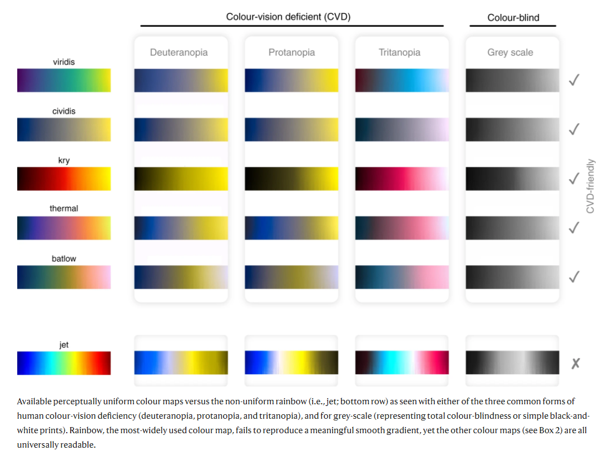
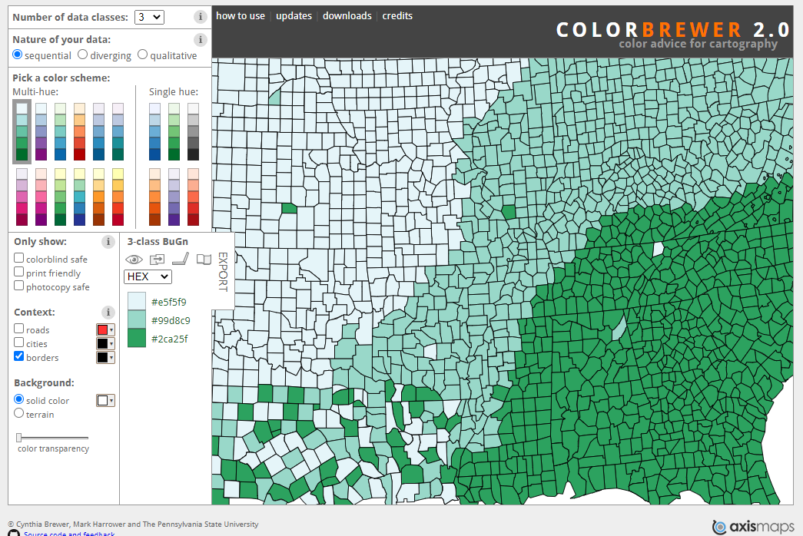
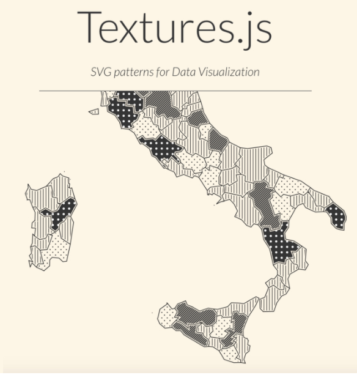

Accessible Data Visualizations
=============

Color
---------

Color can be one of the most challenging - and important - attributes to apply to a plot. Especial care must be taken when applying color to our data visualizations to ensure they are accessible to persons with color blindness. Color blindness prevents viewers from distinguishing between certain colors, their brightness, and/or shades of a color. Affecting approximately 1 in 12 men (8%) and 1 in 200 women (0.5%) around the world, it is likely that some viewers of your data visualization will perceive its colors differently. 

Overall [we're not doing a good job at using color mindfully in our science communication](https://doi.org/10.1038/s41467-020-19160-7). If you want to use color, here are some recommendations to keep in mind:

**Recommendation 1: Avoid problematic color combinations.** The most common types of color blindness makes it hard to tell the difference between red and green (deuteranope and protanope color blindness). Blue-yellow color blindness (tritanope) is less common.
Avoid using: red/green, green/brown, green/blue, blue/gray combinations. Many graphing sofware unfortunately use these combinations as a deafult and you will have to manually change this on your figures.

To demonstrate why these combinations are problematic, here is a color vision test:

*[Crameri, F., Shephard, G.E. & Heron, P.J. The misuse of colour in science communication. Nat Commun 11, 5444 (2020)](https://doi.org/10.1038/s41467-020-19160-7)*

**Recommendation 2: Use an online tool to help you pick a colorblind friendly palette** depending on your data and visualization needs. Examples include:
* [colorbrewer](https://colorbrewer2.org/#type=sequential&scheme=BuGn&n=3): palettes, color advice for mapping, and good general tips
* [coolors](https://coolors.co/)

**Recommendation 3: Use a colorblindness simulator** to check your visualization. Who won't be able to see the differences you're trying to display with color? Here are a few simulators:
* [coblis](http://www.color-blindness.com/coblis-color-blindness-simulator/)
* [color blind web page filter](http://colorfilter.wickline.org)

**Recommendation 4: Add textures**, symbols, or other channels to reinforce the grouping attributes on your plot.

[source](https://wearecolorblind.com/resources/textures-js-patterns-for-data-visualization/

**Recommendation 5: Rethink your plot.** You may not actually need color at all to effectively display your data.

[source](https://www.dataquest.io/blog/what-to-consider-when-choosing-colors-for-data-visualization/)

Here are some more resources to help you use color effectively and mindfully in your data visualizations:

Color & Design:
* [Visualization-Aware Color Design: Aesthetic, Perceptual & Functional Constraints](https://pdfs.semanticscholar.org/f08f/5057726111a9146de85baaf206f53dc7ce2c.pdf)
* [Common pitfalls of color use](https://serialmentor.com/dataviz/color-pitfalls.html)
* [An experiment showing how mark type influences color perception in data viz](https://cmci.colorado.edu/visualab/papers/colordiff_vis2017.pdf)
* [Textures and patterns for colorblindness](https://wearecolorblind.com/resources/textures-js-patterns-for-data-visualization/)

Color Accessibility in R:  
* [RColorBrewer package in R](http://ugrad.stat.ubc.ca/R/library/RColorBrewer/html/ColorBrewer.html
* [R color cheatsheet](https://www.nceas.ucsb.edu/~frazier/RSpatialGuides/colorPaletteCheatsheet.pdf)
