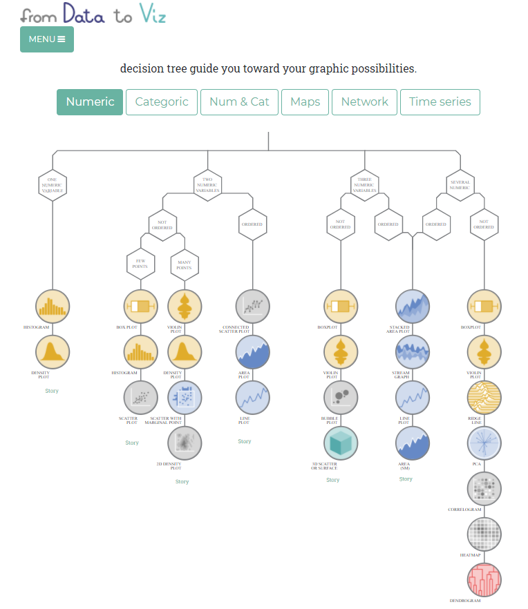

Types of Statistical Graphics
=============

You are now ready to make your plot! You can combine marks and channels to create nearly any plot type, and there are many established types of statistical graphics that you can choose from to showcase your data. Each type has its benefits, and drawbacks, based on how it encodes your data. Match the chart type to your data - and what you want it to show - and not the other way around.

Step 1: Identify Your Data Type
-------------------

Data can be quantiative or qualitative. Quantitative data is either continuous (numerical data like height and weight), or discrete (constrained values, such as the number of children in a family). Qualitative data can be ordered (categories that have a relationship but no meaningful distance between them, such as movie star ratings), or nominal (categories that have no meaningful order, such as gender).

Step 2: Determine Your Functional Approach
-------------------------

Ask ask yourself:

* What are the tasks you want the visual to support?
   * Showing how values compare to each other? How the data are distributed? How they are composed? How values relate?
* What specific visual best supports those tasks?
* What do you expect people to naturally do in their "visual queries" as they explore the plot?
* How can you modify the graphical marks and channels to support faster queries?

Step 3: Select a Plot Type
-------------------

Now that you've identified your data types and what you need your visualization to show, explore your different chart type options!

using this nifty tool by [from Data to Viz](https://www.data-to-viz.com/). Select your data type(s) and click through for the pros, cons, and alternate options for a bevy of charts.

For example, if you want to enable acurate comparisons of individual quantitative values and their relationships, try a scatterplot or a chart with lines or bars sitting aligned on a single axis.

Common Plot Types
--------------------
The following list contains an overview of some of the most common plot types you may encounter:

**Single quantitative variables** are plotted to show the frequency distribution of the data. While **historgrams** are the most common density plots, a single quantiative variable can also be plotted using a rug plot/strip chart, boxplot, or violin plot (described below, where they're most commonly employed).

**Two quantiative variables** can be plotted using a:
* **Scatterplot** - each axis encodes the values of a different quantitative variable, and individual data are represented as points (or dots) on the chart.
* * **Line plot** - data points are connected by straight lines. Line-scatter plots are are common for time series or trend data.

**One quantitative + one qualitative variable** are suitable for a:
* **Bar chart** - bars represent the amount of data in different categories of a variable. One axis encodes the frequencies of the quantitative data, and the other axis the categories of the qualitative data.
* **Boxplot** - shows the median, quartiles, and bounds of your data.
* **Violin plot** - in essence a boxplot that also shows the distribution of your quantiative variable.
* **Word cloud** - these eyecatching visualizations display a list of words with their font size corresponding to their importance. But, they require huge sample sizes and are not very useful as they often distort reality. For example, long words will look more prominent just because they have more letters and cover more area - our eyes don't intuitively parse out word height from length.
* **Pie chart** - uses relative frequencies to show how large each category is in relation to the whole. 
 *Pie charts are grudgingly listed here because you will see them in the wild, but resist the temptation to use them!* Based on our visual perception, pie charts are inherently problematic because they encode values as visual attributes. Pie charts encode data as the area of each slice, as well as the angle that it forms in the center of the pie, making it difficult to easily perceive and compare differences. Over [492 posts on WTF Visualizations are tagged as pie charts.](https://viz.wtf/archive/tagged/piechart) Almost any other chart type is better than a pie chart.

Other complex plot types you may encounter that layer additional marks and channels on the above chart types are:

* **Lollipop chart** - a dot chart where the dots are connected by lines to an axis.
* **Moasic plot** - also called a treemap, these plots display hierarchical data as sets of nested rectangles sized proportionately to their values.
* **Bubble plots** - scatterplots where the size of a dot corresponds to a third numerical or ordered categorical value.
* **Radar plots / star chart** - line plots where each variable has its own axis and all axes are joined at the center of the figure.
* **Network diagrams** - also called graphs, these plots show connections (edges) between entities (nodes). To learn more about network diagrams, check out DataLab's [network toolkit](https://datalab.ucdavis.edu/networks/) and [network analysis workshop](https://www.youtube.com/watch?v=H6IkFnykX1s&feature=youtu.be).

Google also has an [interactive plot gallery](https://developers.google.com/chart/interactive/docs/gallery?csw=1). And [this Stack Exchange post](https://stats.stackexchange.com/questions/78844/a-gallery-of-charts-diagrams-and-plot-types) has even more chart type resources.

But remember, some encodings are more difficult to accurately decode. When in doubt, stick to simple figures with points and lines.

Aside - What About Maps?!
-------------------------

Geospatial data visualization by nature is complex and encodes a lot of attributes - and [it has its own workshop.](https://datalab.ucdavis.edu/eventscalendar/dsi-workshop-geospatial-data-visualization/)

Step 4: Iterate
-----------

Create your visual, and run through step 2 again keeping in mind the principles of visual perception, effectiveness and efficiency. Does it meet your needs? If not, try a different type. **Graphing, like writing, requires continuous editing.**
